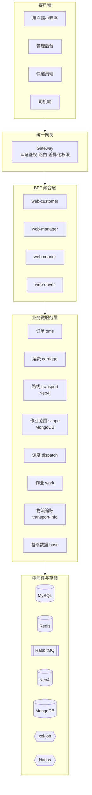
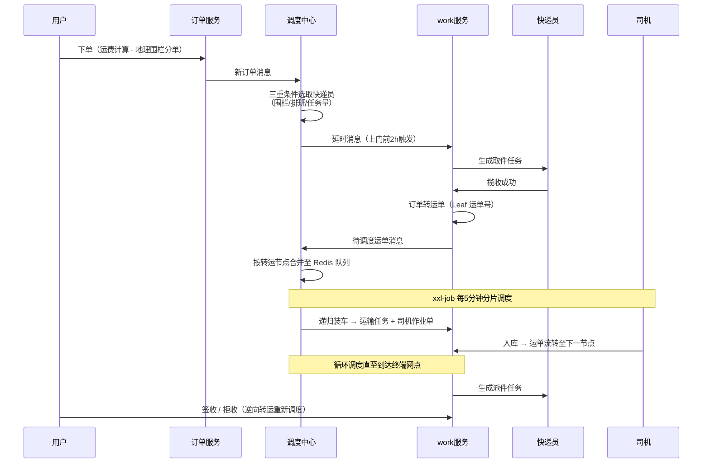

# sl-express · 神领物流系统（微服务独立实现）

       

> 基于《神领物流》课程**从 0 独立实现**的物流快运平台，覆盖 **下单 → 智能调度 → 干线运输 → 末端派件** 全链路业务，服务用户、快递员、司机、管理四端。

## 项目简介

物流快运行业的全链路运输平台：用户在小程序下单后，系统基于 **MongoDB 地理围栏**自动分单至所属网点，**调度中心按快递员排班与任务量均衡分配**取件任务；揽收后订单转为运单，经 **Neo4j 路线规划**得出多级中转方案，**Redis 队列按转运节点合并运单**，由 **xxl-job 分片调度**完成装车分配并生成运输任务与司机作业单；司机入库驱动运单沿链路逐级流转，直至末端派件签收。

项目按微服务拆分 16 个服务，从需求分析、表结构设计、业务编码到 Jenkins 持续集成部署独立完成。

## 业务全景

## 系统架构

## 核心业务流程

## 技术栈

| 分层 | 技术 |
|---|---|
| 微服务框架 | Spring Boot · Spring Cloud Alibaba（Nacos / Gateway / OpenFeign） |
| 存储 | MySQL（MyBatis-Plus）· Redis · **Neo4j**（路线图数据）· **MongoDB**（地理围栏/轨迹） |
| 消息 | RabbitMQ（延迟/死信队列 + Confirm/ACK + 消费幂等） |
| 调度 | **xxl-job**（分片广播）· **美团 Leaf**（号段模式分布式 ID） |
| 分布式 | Redisson 分布式锁 · Seata |
| 认证 | JWT 双 token 三验证 + Redis，网关统一鉴权，四端差异化权限 |
| 可观测 | SkyWalking 链路追踪 · GrayLog 日志集中检索 |
| 工程化 | Git · Maven 私服 · Jenkins CI/CD · Docker/docker-compose |

## 核心亮点

### 1. 消息驱动的智能调度中心

调度与存储彻底分离：`dispatch` 服务**只做计算、不持久化**，以「收消息 → 纯计算 → 发消息」模式运行，无状态可水平扩容；任务数据由 `work` 服务统一落库，二者经 RabbitMQ 解耦。

- **快递员均衡分配**：服务范围（MongoDB 地理围栏）→ 当日排班 → 当日任务量最小，三重条件过滤，避免忙闲不均
- **预约单精准触发**：期望上门时间距当前超过 2 小时的订单，经 RabbitMQ 延时消息在上门前 2 小时投递，实时单即时下发

### 2. 运单合并与分片装车调度

- **按转运节点合并**：相同「当前节点 → 下一节点」的运单写入同一 Redis List（LPUSH/RPOP 先进先出），Set 结构记录在途运单实现**消息幂等过滤**
- **分片并行调度**：xxl-job 分片广播使多节点并行处理车辆计划；以「起点-终点」队列粒度加 **Redisson 公平锁**互斥，确保同一队列装载不被并发抢占
- **递归装车**：按载重/体积 **95% 余量双约束**校验运力，超限运单回放队尾以保持处理顺序；一次调度批量生成运输任务与司机作业单

### 3. Neo4j 路线规划

运输网络建模为图：**机构为节点、线路为带成本/距离属性的双向边**，Spring Data Neo4j 自定义 Cypher 深度查询，实现跨转运层级的**成本优先**最优路线计算。机构数据经 RabbitMQ 从权限中台异步同步至 Neo4j，保证图数据与组织架构最终一致。

### 4. 美团 Leaf 号段模式分布式 ID

运单号要求 `SL + 13 位数字`，雪花 ID 位数超限、数据库自增存在单点瓶颈，故采用 Leaf 号段模式：

- 当前号段消耗至 **10% 时异步预加载下一号段（双 buffer）**，规避临界点阻塞，DB 短暂宕机仍可持续发号 10 分钟以上
- 号段长度按高峰期发号 QPS 的 600 倍配置，兼顾 DB 压力与容错能力

### 5. 双 token 三验证认证体系

解决单 token 模式「有效期长则被盗用风险高、无状态则无法强制失效」的两个固有问题：

- `access_token`（5min）承载业务请求，`refresh_token`（24h）**一次一换**实现无感续期，旧 token 即刻作废、天然防重放
- refresh_token 落 Redis 有状态化，网关侧完成**签名 / 有效期 / Redis 状态**三重校验，支持异常场景强制下线

### 6. MongoDB 地理围栏与物流追踪

- **地理围栏**：快递员/机构作业范围以 GeoJSON 多边形 + **2dsphere 球面索引**存储，`$geoWithin` 毫秒级判定「坐标 → 所属网点」，支撑下单自动分单与按位置选取快递员
- **物流轨迹**：轨迹数据海量写入 MongoDB，查询链路落地 **Caffeine（进程内）+ Redis 二级缓存**；空值缓存防穿透、互斥锁防击穿、随机 TTL + 逻辑过期防雪崩

### 7. 运费计算（责任链模式）

从 0 搭建运费微服务，责任链逐节点匹配运费模板（同城/省内/跨省 × 经济/特快），实现**首重/续重分段计费**；新增计费规则零侵入扩展，替代多层 if-else。

### 8. 可靠消息与幂等设计

全链路基于 RabbitMQ 异步解耦（订单 → 调度 → 取派件 → 运输），通过延迟队列实现预约触发与事务消息延迟投递，死信队列兜底异常消息；消费端以业务状态机做**幂等去重**（如「订单号 + 任务状态」判重、Redis Set 在途判重），保障最终一致性。

## 模块划分

| 模块 | 职责 | 核心技术 |
|---|---|---|
| `sl-express-gateway` | 统一网关：路由、认证鉴权 | Gateway + JWT + Redis |
| `sl-express-ms-web-customer` | 用户端聚合服务（小程序） | 微信登录 + 双 token |
| `sl-express-ms-web-manager` | 管理后台聚合服务 | 权限管家 RBAC + 短信验证码 |
| `sl-express-ms-web-courier` | 快递员端聚合服务 | 权限管家 |
| `sl-express-ms-web-driver` | 司机端聚合服务 | 权限管家 |
| `sl-express-ms-user` | 会员服务 | Spring Boot |
| `sl-express-ms-carriage` | 运费计算 | 责任链模式 |
| `sl-express-ms-transport` | 路线规划、线路管理 | Neo4j + SDN |
| `sl-express-ms-service-scope` | 作业范围（地理围栏） | MongoDB 2dsphere |
| `sl-express-ms-dispatch` | 智能调度中心 | RabbitMQ 纯计算 |
| `sl-express-ms-work` | 取派件任务、运输任务 | xxl-job + Redisson |
| `sl-express-ms-transport-info` | 物流追踪 | Caffeine + Redis 多级缓存 |
| `sl-express-ms-base` | 基础数据（车辆/车次/排班） | MySQL |
| `sl-express-ms-sms` | 短信服务 | 阿里云 SMS |
| `sl-express-common` | 通用工具、MQ 常量、Leaf 封装 | - |
