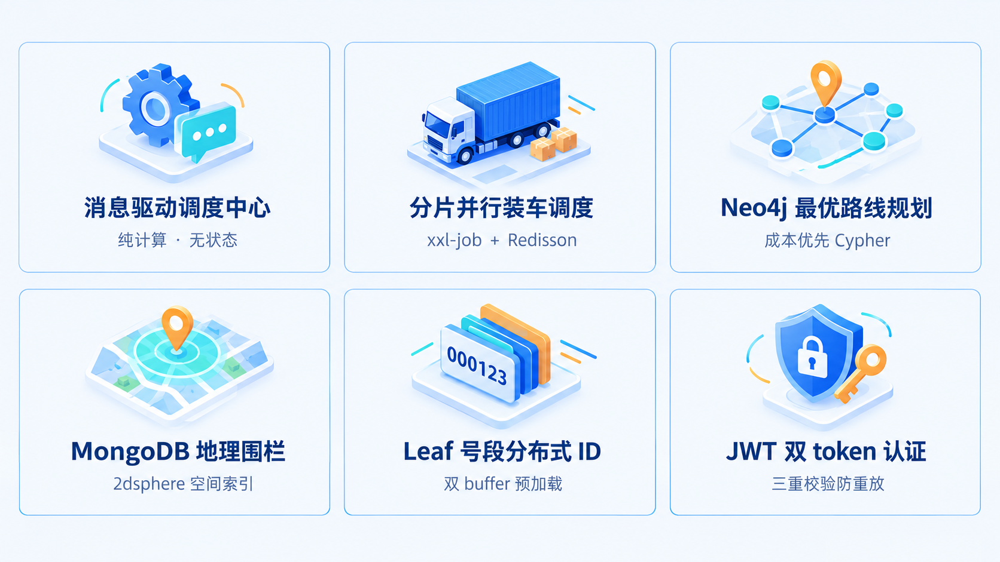
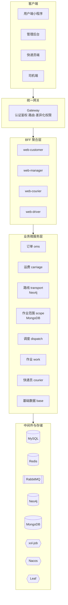
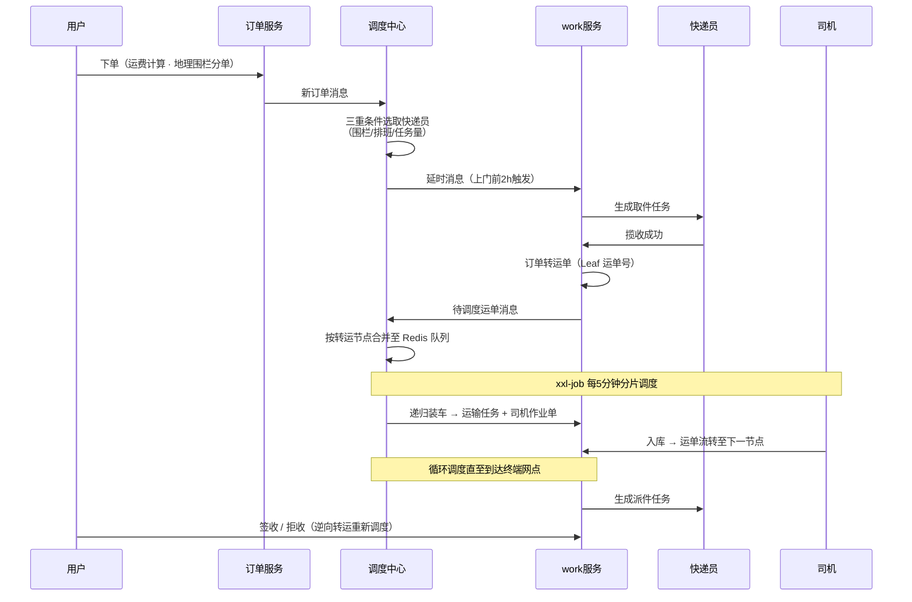

# sl-express · 神领物流系统

       

> 物流快运平台，覆盖 **下单 → 智能调度 → 干线运输 → 末端派件** 全链路业务，服务用户、快递员、司机、管理四端。

## 目录

- [项目简介](#项目简介)
- [技术栈总览](#技术栈总览)
- [系统架构](#系统架构)
- [核心业务流程](#核心业务流程)
- [核心业务流程详解](#核心业务流程详解)
- [高级技术亮点](#高级技术亮点)
- [模块划分](#模块划分)
- [高级技术一览表](#高级技术一览表)

## 项目简介

物流快运行业的全链路运输平台：用户在小程序下单后，系统基于 **MongoDB 地理围栏**自动分单至所属网点，**调度中心按快递员排班与任务量均衡分配**取件任务；揽收后订单转为运单，经 **Neo4j 路线规划**得出多级中转方案，**Redis 队列按转运节点合并运单**，由 **xxl-job 分片调度**完成装车分配并生成运输任务与司机作业单；司机入库驱动运单沿链路逐级流转，直至末端派件签收。

项目按微服务拆分 **16 个服务**，从需求分析、表结构设计、业务编码到 Jenkins 持续集成部署独立完成。

## 技术栈总览

| 分层 | 技术 | 项目中的实际用途 |
|---|---|---|
| **微服务框架** | Spring Boot 2.7 / Spring Cloud Alibaba | 全部 16 个服务的基础框架与统一依赖管理（`sl-express-parent`） |
| **注册/配置中心** | Nacos | 服务注册发现 + 多环境配置中心（bootstrap 配置加载） |
| **服务网关** | Spring Cloud Gateway | 统一入口，路由转发、JWT 校验、四端差异化过滤器 |
| **远程调用** | OpenFeign + LoadBalancer | 服务间声明式 HTTP 调用（如调度中心调用 courier、work 服务） |
| **ORM** | MyBatis-Plus | MySQL 数据访问层，Lambda 条件构造 |
| **关系数据库** | MySQL 8.0 | 订单、运单、取派件任务、运输任务、运费模板等核心业务数据 |
| **缓存** | Redis + Caffeine | 运单合并队列、在途运单 Set、refresh_token 存储；Caffeine 进程内缓存构成多级缓存 |
| **分布式锁** | Redisson | 调度装车公平锁，按「起点-终点」队列粒度互斥 |
| **消息队列** | RabbitMQ | 全链路异步解耦主干道，延迟队列（`delayed` 插件）、死信队列、Confirm/ACK |
| **图数据库** | Neo4j 5 | 路线规划核心：机构为节点、线路为带成本属性的双向边，Cypher 深度查询 |
| **文档数据库** | MongoDB | 作业范围地理围栏（GeoJSON + 2dsphere 索引）、物流轨迹存储 |
| **分布式调度** | xxl-job | 运输任务分片广播调度、失败消息定时重试（`failMsgJob`） |
| **分布式 ID** | 美团 Leaf | 号段模式生成运单号（`SL` + 13 位数字），双 buffer 预加载 |
| **分布式事务** | Seata | 跨服务数据一致性保障 |
| **认证授权** | JWT + Redis + 权限管家 | 双 token 三验证；RBAC 权限中台 SDK（`itcast-auth`）管理四端账号与组织架构 |
| **链路追踪** | SkyWalking | 全链路调用链追踪、性能瓶颈定位 |
| **日志检索** | GrayLog | 分布式日志集中采集与检索（`logstash-gelf` 输出） |
| **地图服务** | EagleMap | 地址解析、经纬度查询中台（封装为 `eaglemap-spring-boot-starter`） |
| **文档/工具** | Knife4j、EasyExcel、EasyCaptcha、Hutool | API 文档、批量导入、验证码、工具库 |
| **工程化** | Git / Maven 私服 / Jenkins / Docker · docker-compose | CI/CD 流水线与容器化部署 |

## 系统架构

```mermaid
flowchart TB
    subgraph client[客户端]
        direction LR
        C1[用户端小程序]
        C2[管理后台]
        C3[快递员端]
        C4[司机端]
    end
    subgraph gw[统一网关]
        GW[Gateway<br/>认证鉴权·路由·差异化权限]
    end
    subgraph bff[BFF 聚合层]
        direction LR
        W1[web-customer]
        W2[web-manager]
        W3[web-courier]
        W4[web-driver]
    end
    subgraph svc[业务微服务层]
        direction LR
        S1[订单 oms]
        S2[运费 carriage]
        S3[路线 transport<br/>Neo4j]
        S4[作业范围 scope<br/>MongoDB]
        S5[调度 dispatch]
        S6[作业 work]
        S7[快递员 courier]
        S8[基础数据 base]
    end
    subgraph mw[中间件与存储]
        direction LR
        M1[(MySQL)]
        M2[(Redis)]
        M3[[RabbitMQ]]
        M4[(Neo4j)]
        M5[(MongoDB)]
        M6{{xxl-job}}
        M7{{Nacos}}
        M8{{Leaf}}
    end
    client --> gw --> bff --> svc
    svc --> mw
```

> 服务间两条通信链路：**实时查询走 OpenFeign 同步调用**（如调度中心查快递员、作业范围），**业务流转走 RabbitMQ 异步消息**（下单 → 调度 → 取派件 → 运输全链路）。

## 核心业务流程

```mermaid
sequenceDiagram
    participant U as 用户
    participant O as 订单服务
    participant D as 调度中心
    participant W as work服务
    participant C as 快递员
    participant Dr as 司机

    U->>O: 下单（运费计算 · 地理围栏分单）
    O->>D: 新订单消息
    D->>D: 三重条件选取快递员<br/>（围栏/排班/任务量）
    D->>W: 延时消息（上门前2h触发）
    W->>C: 生成取件任务
    C->>W: 揽收成功
    W->>W: 订单转运单（Leaf 运单号）
    W->>D: 待调度运单消息
    D->>D: 按转运节点合并至 Redis 队列
    Note over D,Dr: xxl-job 每5分钟分片调度
    D->>W: 递归装车 → 运输任务 + 司机作业单
    Dr->>W: 入库 → 运单流转至下一节点
    Note over D,W: 循环调度直至到达终端网点
    W->>C: 生成派件任务
    U->>W: 签收 / 拒收（逆向转运重新调度）
```

## 核心业务流程详解

### 1. 下单与运费计算

- **运费计算**（`sl-express-ms-carriage`）：下单时根据「起始/目的地」计算运费，**责任链模式**逐节点匹配运费模板（同城 → 省内 → 跨省 → 经济/特快经济），命中即返回，按模板**首重/续重分段计费**；新增计费规则零侵入扩展，替代多层 if-else 嵌套。
- **订单创建**（`sl-express-ms-oms`）：落库订单并驱动状态机（待取件 → 揽收成功 → 运输中 → 派送中 → 已签收 / 已拒收），向外发送新订单消息进入调度链路。

### 2. 智能分单与快递员分配（调度中心第一阶段）

- **地理围栏分单**：调度中心经 OpenFeign 调用 `service-scope` 服务，以订单坐标查询 MongoDB（`Criteria.where("polygon").intersects(point)`，2dsphere 球面索引），毫秒级判定坐标所属**网点**与可接单**快递员**。
- **三重条件均衡分配**（`OrderMQListener`）：按 ①服务范围（地理围栏）→ ②当日排班 → ③当日任务量最小 依次过滤候选快递员，避免忙闲不均。
- **预约单精准触发**：期望上门时间距当前超过 2 小时的订单，经 RabbitMQ **延迟消息**（`x-delayed-message` 插件）在上门前 2 小时才投递；实时单即时下发。

### 3. 取派件任务（`sl-express-ms-work`）

- 消费调度消息生成取件/派件任务，以「**订单号 + 任务类型**」做幂等判重，防止消息重复投递产生脏数据。
- 快递员上门取件成功 → 订单状态更新，触发「订单转运单」。

### 4. 订单转运单（运单号生成）

- 揽收成功后订单转为**运单**（TransportOrder），运单号通过 **美团 Leaf 号段模式**生成：`SL` 前缀 + 13 位数字。
- 运单状态机：`CREATED 新建 → LOADED 已装车 → PROCESSING 运输中 → ARRIVED_END 到达终端网点 → 派件/签收`，拒收进入 `REJECTED` 逆向流转。

### 5. 运单合并与装车调度（调度中心第二阶段）

- **按转运节点合并**（`TransportOrderDispatchMQListener`）：待调度运单消息到达后，按「当前节点 → 下一节点」写入同一 Redis List（`LPUSH`/`RPOP` 先进先出）；Set 结构记录在途运单实现**消息幂等过滤**，同一运单重复消息直接丢弃。
- **分片并行调度**（`DispatchJob`）：xxl-job 分片广播将车辆计划按 `shardIndex % shardTotal` 均摊到多节点并行处理；每辆车处理前以「起点-终点」队列粒度加 **Redisson 公平锁**（`getFairLock`），同一队列装载不被并发抢占。
- **递归装车**：逐单 `RPOP` 后累加重量/体积，超过车辆运力 **95% 余量**（载重/体积双约束）即将该运单 `RPUSH` 回队尾并结束装车，保证队列处理顺序；一次调度批量生成**运输任务 + 司机作业单**。

### 6. 干线运输与路线规划（`sl-express-ms-transport`）

- 运输网络建模为 Neo4j 图：**机构为节点、线路为带成本/距离属性的双向边**，Spring Data Neo4j（`Neo4jClient`）自定义 Cypher。
- `shortestPath` 最短路径兜底；成本优先查询按 `sum(r.cost)` 排序，实现跨转运层级的**成本优先 > 转运节点优先**最优路线。
- 机构数据经 RabbitMQ 从权限中台异步同步至 Neo4j，保证图数据与组织架构最终一致；司机逐节点入库，运单流转至下一节点后**重新进入调度**，循环直至到达终端网点。

### 7. 末端派件与签收

- 运单到达终端网点后生成**派件任务**，同样经三重条件分配给该网点快递员。
- 用户签收完成正向链路；拒收则生成逆向运单、重新进入调度链路。

### 8. 可靠消息与异常兜底（`sl-express-mq`）

- 全链路基于 RabbitMQ 异步解耦，封装统一 `MQService`：**本地消息表 + Confirm/ACK** 保障可靠投递，延迟队列支撑预约触发与延迟事务消息，死信队列兜底异常消息。
- 消费失败落库 `FailMsgEntity`，由 xxl-job `failMsgJob` 定时扫描重投（每批 100 条），保障**最终一致性**。

## 高级技术亮点

### 1. 消息驱动的智能调度中心

调度与存储彻底分离：`dispatch` 服务**只做计算、不持久化**，以「收消息 → 纯计算 → 发消息」模式运行，无状态可水平扩容；任务数据由 `work` 服务统一落库，二者经 RabbitMQ 解耦。

### 2. 运单合并与分片装车调度

- **Redis List 按节点合并** + Set 在途判重幂等；xxl-job 分片广播多节点并行，Redisson **公平锁**以「起点-终点」队列粒度互斥。
- **递归装车**按载重/体积 95% 余量双约束校验运力，超限运单回放队尾保持处理顺序。

### 3. Neo4j 图数据库路线规划

机构-线路图模型 + 自定义 Cypher 深度查询（最短路径 + 成本优先双策略），`PathValue` 手动结果映射；选型理由：多层转运关系在关系库中需递归 CTE，图数据库天然适配。

### 4. MongoDB 地理围栏与多级缓存

- 作业范围以 GeoJSON 多边形 + **2dsphere 球面索引**存储，`$geoIntersects` 毫秒级判定「坐标 → 所属网点」。
- 物流轨迹海量写入 MongoDB，查询链路 **Caffeine（进程内）+ Redis 二级缓存**：空值缓存防穿透、互斥锁防击穿、随机 TTL + 逻辑过期防雪崩。

### 5. 美团 Leaf 号段模式分布式 ID

运单号要求 `SL + 13 位数字`，雪花 ID 位数超限、数据库自增存在单点瓶颈，故采用号段模式：当前号段消耗至 **10% 时异步预加载下一号段（双 buffer）**，规避临界点阻塞，DB 短暂宕机仍可持续发号。

### 6. 双 token 三验证认证体系

解决单 token「有效期长则被盗用风险高、无状态则无法强制失效」的固有问题：

- `access_token`（短效）承载业务请求，`refresh_token`（长效）落 Redis 并**一次一换**实现无感续期，旧 token 即刻作废、天然防重放。
- 网关侧完成**签名验证 / 有效期验证 / Redis 状态验证**三重校验，支持异常场景强制下线；四端通过自定义 `GatewayFilterFactory` 差异化校验。

### 7. 责任链模式运费计算

`CarriageChainHandler` 抽象 + 同城/省内/跨省/经济四个处理器逐节点匹配，命中即返回；新增计费规则零侵入扩展。

### 8. 统一网关与 BFF 聚合层

网关统一完成路由、认证、白名单放行；四个 BFF 聚合服务面向各自的端组合下游接口，避免端到微服务的直连耦合。

## 模块划分

| 模块 | 职责 | 核心技术 |
|---|---|---|
| `sl-express-gateway` | 统一网关：路由、认证鉴权 | Gateway + JWT + Redis + 权限管家 SDK |
| `sl-express-ms-web-customer` | 用户端聚合服务（小程序） | 微信登录 + 双 token 三验证 |
| `sl-express-ms-web-manager` | 管理后台聚合服务 | 权限管家 RBAC + EasyExcel 导入 |
| `sl-express-ms-web-courier` | 快递员端聚合服务 | 权限管家 |
| `sl-express-ms-web-driver` | 司机端聚合服务 | 权限管家 |
| `sl-express-ms-user` | 会员服务 | MyBatis-Plus |
| `sl-express-ms-carriage` | 运费计算 | 责任链模式 |
| `sl-express-ms-transport` | 路线规划、线路管理 | Neo4j + Spring Data Neo4j + EagleMap |
| `sl-express-ms-service-scope` | 作业范围（地理围栏） | MongoDB 2dsphere + GeoJSON |
| `sl-express-ms-dispatch` | 智能调度中心（纯计算） | RabbitMQ + Redis + Redisson + xxl-job |
| `sl-express-ms-work` | 取派件任务、运输任务、运单 | MyBatis-Plus + Leaf + RabbitMQ |
| `sl-express-ms-courier` | 快递员管理、排班任务统计 | MyBatis-Plus + Redis |
| `sl-express-ms-base` | 基础数据（车辆/车次/排班/车辆计划） | MyBatis-Plus + xxl-job |
| `sl-express-ms-oms` | 订单服务 | 状态机 + RabbitMQ |
| `sl-express-mq` | MQ 通用封装：可靠投递 + 失败重试 | RabbitMQ + 本地消息表 + xxl-job |
| `sl-express-common` | 通用工具、常量、Leaf 封装、JWT 工具 | - |

## 高级技术一览表

| 高级技术 | 解决的问题 | 所在模块 |
|---|---|---|
| 消息驱动调度中心（纯计算无状态） | 计算与存储解耦，调度层可水平扩容 | `dispatch` |
| Redis List 合并 + Set 幂等 | 海量运单按节点归队，重复消息零脏数据 | `dispatch` |
| xxl-job 分片广播 + Redisson 公平锁 | 多节点并行调度同一批车辆不冲突 | `dispatch` |
| 递归装车（95% 载重/体积双约束） | 运力最大化且不超载，保序回放 | `dispatch` |
| Neo4j 最短路径 + 成本优先 Cypher | 多级中转路线最优计算 | `transport` |
| MongoDB 2dsphere 地理围栏 | 坐标 → 网点/快递员毫秒级判定 | `service-scope` |
| Caffeine + Redis 多级缓存 | 轨迹查询抗高并发，三空问题治理 | `transport-info` |
| 美团 Leaf 号段模式（双 buffer） | 高并发下分布式 ID 有序 + 高可用 | `common` / `work` |
| JWT 双 token 三验证 | 无感续期 + 可强制下线 + 防重放 | `web-customer` / `gateway` |
| 责任链模式运费计算 | 计费规则可扩展、零侵入 | `carriage` |
| 本地消息表 + Confirm/ACK + 死信重试 | 全链路可靠消息、最终一致性 | `mq` |
| RabbitMQ 延迟消息（x-delayed） | 预约单上门前 2h 精准触发 | `dispatch` / `oms` |
